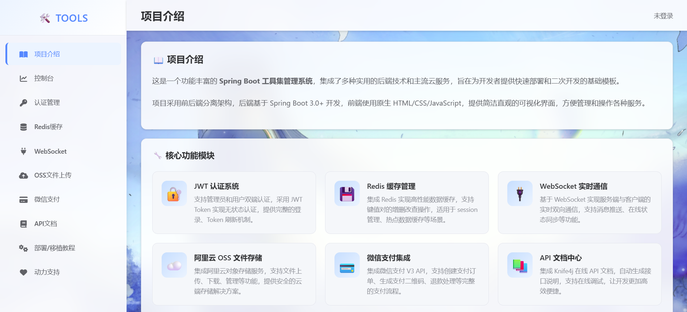

## Project Introduction

This is a feature-rich Spring Boot toolkit management system, integrating a variety of practical backend technologies and mainstream cloud services, designed to provide developers with a basic template for rapid deployment and secondary development.

## Attention!!!

This project is still under development, please do not use in production environments.

## Project Display

